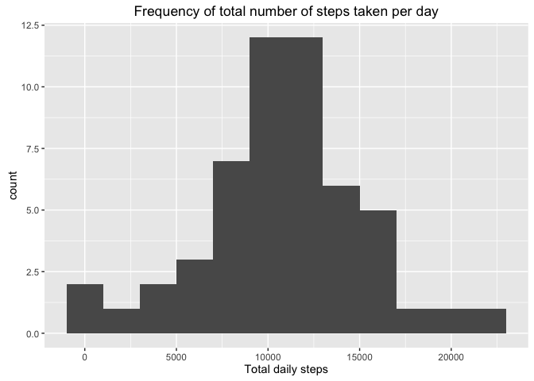
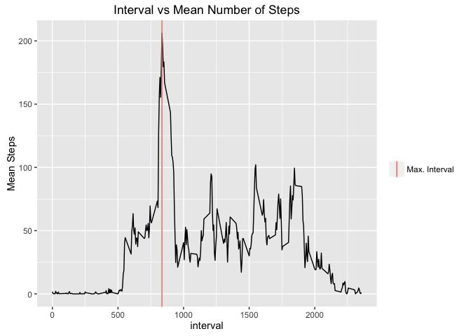
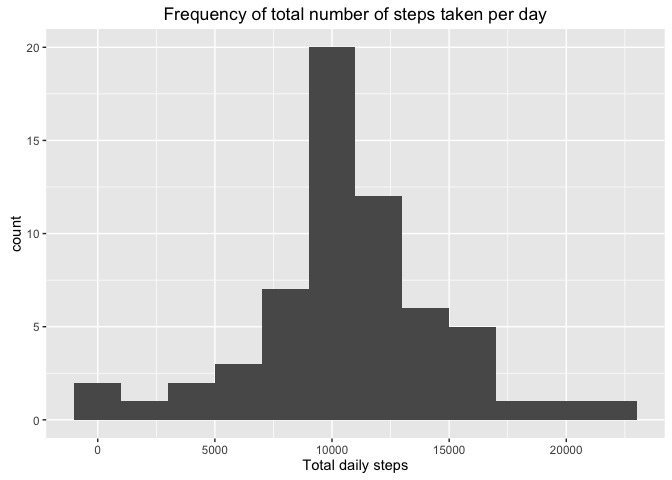
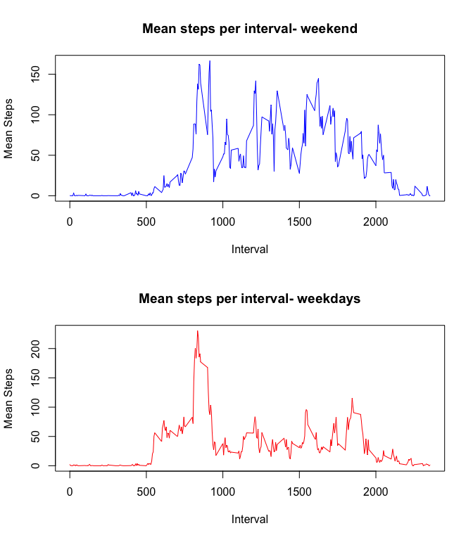

# Reproducible Research: Peer Assessment 1
##Background
This is is the first assignment for the [Coursera Reproducible Research](https://www.coursera.org/learn/reproducible-research) course.


## Loading and preprocessing the data

```r
library(lubridate)
library(ggplot2)
##Read in data
df<-read.csv("activity.csv")
##convert date column into date class
df$date<-ymd(df$date)
```


## What is mean total number of steps taken per day?

```r
##calculate steps by each day
steps<-aggregate(df$steps, by=list(date=df$date), FUN=sum)

##remove na days
steps<-steps[complete.cases(steps),]

##calculate mean steps per day
meanDailySteps<-mean(steps$x)
medianDailySteps<-median(steps$x)
```

**The mean daily steps per day is: 10766.19 and the median is: 10765.**

A histogram of daily steps is:

```r
##Create plot of steps per day
ggplot(steps, aes(x))+geom_histogram(binwidth = 2000)+xlab("Total daily steps")+ ggtitle("Frequency of total number of steps taken per day")
```

<!-- -->


## What is the average daily activity pattern?

```r
##calculate mean steps by each interval
intervalSteps<-aggregate(df$steps, by=list(interval=df$interval), FUN=mean, na.rm=TRUE)

##Calculate interval wih highest mean
maxMeanSteps=intervalSteps[which.max(intervalSteps$x),1]
```
A time series plot of interval number vs average number of steps:


```r
ggplot(intervalSteps, aes(interval, x)) + geom_line()+ylab("Mean Steps") + ggtitle("Interval vs Mean Number of Steps") +geom_vline(aes(xintercept = as.numeric(maxMeanSteps), color="Max. Interval"))+labs(color="")
```

<!-- -->

**The interval with the highest mean number of steps is: 835 as indicated with the vertical line in the plot.**

## Imputing missing values

```r
##calculate number of incomplete cases
incompleteCases<- sum(!complete.cases(df))
```

**There are 2304 incomplete cases in the database.  We will impute missing intervals by assigning to them the mean number of steps for that interval.**


```r
##If cases is incomplete replace missing step count with the mean for that interval
imputedf<-df

for(i in 1:nrow(imputedf)){
  if(is.na(imputedf[i,1])){
    imputedf[i,1]<-intervalSteps[intervalSteps$interval==imputedf[i,3],2]
  }
}

##Calculate mean and median of each day for imputed data

imputeSteps<-aggregate(imputedf$steps, by=list(date=imputedf$date), FUN=sum)

imputeStepsMean<-mean(imputeSteps$x)
imputeStepsMedian<-median(imputeSteps$x)
```
A histogram of total daily number of steps after imputing:


```r
ggplot(imputeSteps, aes(x))+geom_histogram(binwidth = 2000)+xlab("Total daily steps")+ ggtitle("Frequency of total number of steps taken per day")
```

<!-- -->

**The mean daily steps per day after imputing is: 10766.19 and the median is: 10766.19. 
The imputing method has left the mean the same from the first part of the assignment and increased the median to be equal to the mean.**

## Are there differences in activity patterns between weekdays and weekends?

```r
##Add factor variable to dataset
weekend=c("Saturday", "Sunday")
imputedf$day<-(weekdays(imputedf$date))
imputedf$day<-as.factor(ifelse(is.element(imputedf$day, weekend), "weekend", "weekday"))

weekendImputeDF<-subset(imputedf, day=="weekend")
weekdayImputeDF<-subset(imputedf, day=="weekday")


weekendImputeDF<<-aggregate(weekendImputeDF$steps, by=list(interval=weekendImputeDF$interval), FUN=mean)

weekdayImputeDF<<-aggregate(weekdayImputeDF$steps, by=list(interval=weekdayImputeDF$interval), FUN=mean)
```
A plot of the imputed data showing the difference in mean steps per interval for weekdays vs the weekend:


```r
par(mfrow=c(2,1))
plot(weekendImputeDF$interval, weekendImputeDF$x, type="l", main="Mean steps per interval- weekend", xlab="Interval", ylab="Mean Steps", col="blue")
plot(weekdayImputeDF$interval, weekdayImputeDF$x, type="l", main="Mean steps per interval- weekdays", xlab="Interval", ylab="Mean Steps", col="red") 
```

<!-- -->

**From the plot, we can see that weekdays generally have more steps in the morning and the weekends generally have greater steps in the afternoon and evening.**
